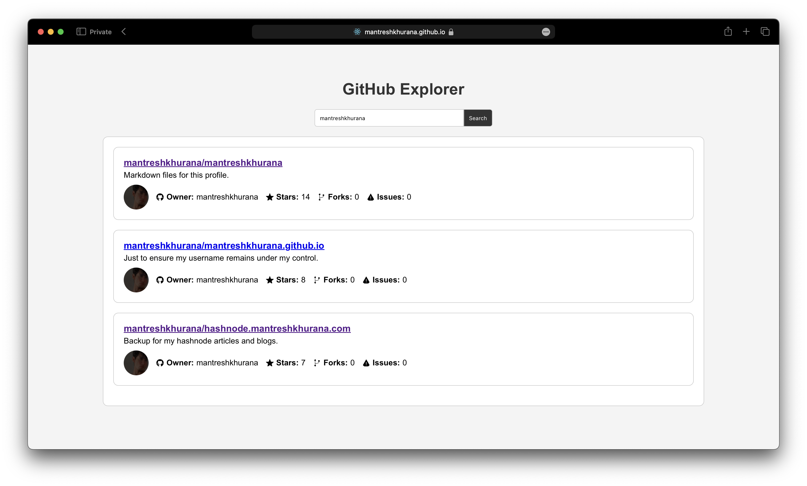

# Github Explorer

A simple react based website to search and explore github repositories using username or repository name. It uses github api to fetch the data, this project was created to help my friend learn reactjs.

## Table of Contents

- [Screenshots](#screenshots)
- [Installation](#installation)
- [Features](#features)
- [Author](#author)

## Screenshots



## Installation

```bash
git clone https://github.com/mantreshkhurana/github-explorer-reactjs
cd github-explorer-reactjs
npm install
npm start
```

## Features

- [x] Search repositories by username
- [x] Search repositories by repository name
- [ ] View repository details
- [x] View repository issues
- [ ] View repository pull requests
- [ ] View repository contributors
- [ ] View repository languages
- [x] View repository forks
- [x] View repository stars
- [ ] View repository watchers
- [ ] View repository license
- [ ] View repository topics
- [ ] View repository releases
- [ ] View repository branches
- [ ] View repository commits
- [ ] View repository tags
- [ ] View repository stargazers

## Author

- [Mantresh](https://github.com/mantreshkhurana)
